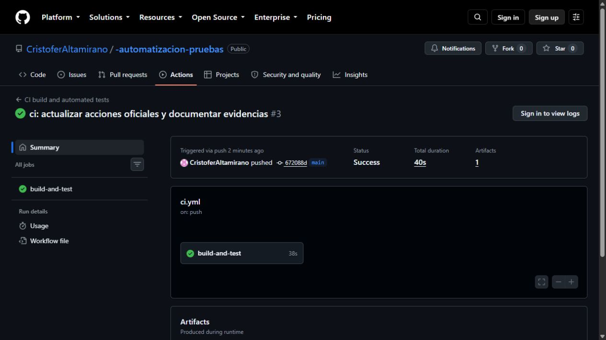
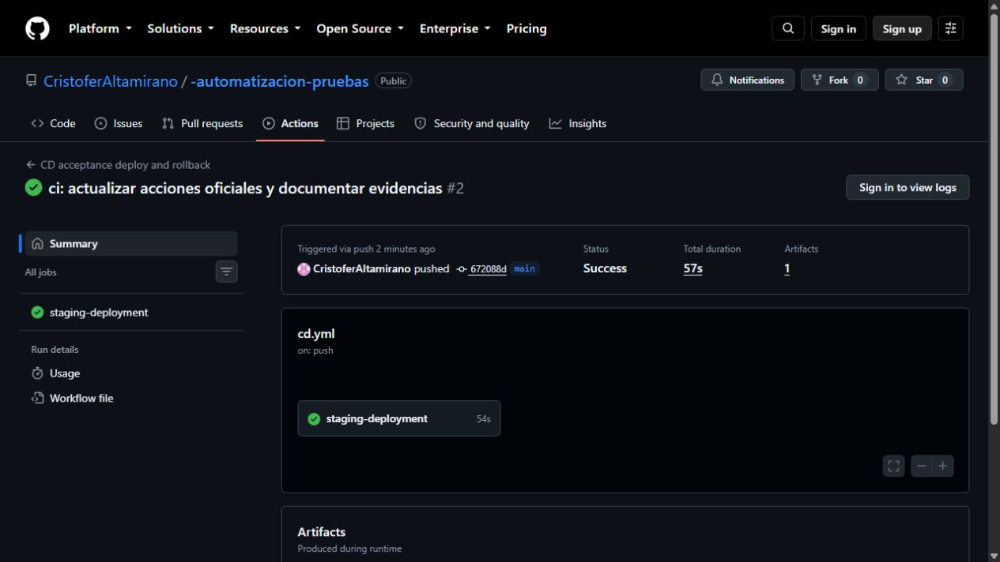

# Automatización de pruebas de un cotizador

Autor: **Cristofer Altamirano**  
Asignatura: Automatización de Pruebas — Examen Final  
Repositorio: https://github.com/CristoferAltamirano/-automatizacion-pruebas

Este proyecto implementa una API HTTP de cotización de pedidos y un proceso reproducible de integración y despliegue. Las pruebas verifican las reglas de cálculo, las respuestas HTTP reales y el funcionamiento del JAR desplegado. El laboratorio demuestra despliegue de la versión 1.1.0 y recuperación de la 1.0.0 mediante rollback manual y automático.

## Requisitos

- JDK 17 o posterior, con `java` y `javac` en PATH.
- Maven 3.9 o posterior, con `mvn` en PATH.
- Windows y PowerShell 7 para los pipelines y scripts de despliegue. Las pruebas Maven también pueden ejecutarse en Linux o macOS.
- Acceso a Maven Central durante la primera resolución de dependencias.
- Puertos locales 18080 y 18081 libres para el laboratorio de despliegue.

GitHub Actions configura Java 17 automáticamente en un runner `windows-latest`, que dispone de Maven y PowerShell 7. No requiere Docker, Jenkins ni servicios de pago.

## Estructura

```text
pom.xml                         Dependencias y plugins Maven
src/main/java/.../App.java      API HTTP
src/main/java/.../QuoteService.java  Reglas de cotización
src/test/java/.../QuoteServiceTest.java  15 casos unitarios
src/test/java/.../ApiIT.java     12 casos de integración
scripts/Invoke-CI.ps1           Stages de build, pruebas y package
scripts/Test-Acceptance.ps1     6 casos de aceptación HTTP
scripts/Deploy.ps1              Despliegue, estado, rollback y detención
scripts/Invoke-CD.ps1           Escenario completo de despliegue y recuperación
.github/workflows/ci.yml        Pipeline de integración continua
.github/workflows/cd.yml        Pipeline de despliegue a laboratorio
docs/PIPELINE.md                Diseño, criterios y procedimiento de rollback
evidence/                      Logs y capturas de ejecuciones reales
artifacts/                     JAR 1.0.0 y JAR 1.1.0 del laboratorio local
```

## Flujo de ramas Trunk Based

`main` es la única rama permanente. Las modificaciones se realizan en ramas cortas `codex/<cambio>`, se validan con CI y se integran rápidamente a `main`. Se identifica cada entrega estable con una etiqueta `vX.Y.Z`. No se mantienen ramas separadas para ambientes: el despliegue utiliza artefactos versionados.

```bash
git switch main
git pull --ff-only
git switch -c codex/nuevo-cambio
# Realizar el cambio y ejecutar las pruebas.
git add .
git commit -m "test: agregar validacion de un caso"
git push -u origin codex/nuevo-cambio
# Abrir un pull request hacia main y revisar el resultado de CI.
```

La implementación inicial se entrega con historial Git y la rama `codex/implementacion` integrada a `main`. La revisión por pull request es la regla para cambios posteriores; no se afirma una revisión externa de esta entrega individual. En un equipo, se recomienda exigir CI y revisión antes de integrar cambios mediante las reglas de protección de `main`.

## API y reglas del ejercicio

- `GET /health`: `200` y `{"status":"UP"}`.
- `GET /version`: `200` y la versión leída del manifiesto del JAR.
- `GET /quote?price=1000&quantity=2&discount=0.1`: `200`, total `2142.00`, moneda `CLP`.
- Parámetros inválidos: `400`; ruta inexistente: `404`; método distinto de GET: `405`.

Fórmula del laboratorio: `precio × cantidad × (1 − descuento) × 1,19`, redondeada a dos decimales con `HALF_UP`. Precio mayor que cero; cantidad entera de 1 a 1000; descuento de 0 a 1, opcional con valor predeterminado 0. El 19 % es una regla configurada en este ejemplo académico. Se usa `BigDecimal` para conservar precisión decimal. El servicio escucha solo en `127.0.0.1`.

## Estrategia de pruebas

| Nivel | Casos | Qué verifica | Herramienta |
|---|---:|---|---|
| Unitarias | 15 | Cálculo, descuento, redondeo, límites y valores nulos | JUnit Jupiter y Surefire |
| Integración | 12 | HTTP real, serialización, servicio de cálculo y errores de entrada | JUnit Jupiter, HttpClient y Failsafe |
| Aceptación | 6 por ejecución | Disponibilidad, versión, cotización y rechazo de entradas sobre el JAR ejecutado | PowerShell y HttpClient |

Las pruebas de integración levantan un servidor real en un puerto aleatorio y lo cierran al terminar. Las de aceptación son externas a la JVM del servicio y comprueban tanto el candidato como el despliegue activo y la versión recuperada. Se utiliza JUnit como dependencia de pruebas; Selenium no es necesario porque el sistema expone una API, sin interfaz de navegador.

## Ejecutar pruebas y pipeline CI

```powershell
mvn -B -ntp clean verify
# Solo unitarias:
mvn -B -ntp test
# Integración, después de compilar los tests:
mvn -B -ntp test-compile failsafe:integration-test failsafe:verify
# Pipeline completo con stages y evidencias:
./scripts/Invoke-CI.ps1
```

`Invoke-CI.ps1` detiene el proceso ante un código de salida distinto de cero. Maven falla si no descubre pruebas. Surefire selecciona `*Test` y Failsafe selecciona `*IT`, evitando mezclar los niveles. Los resultados XML quedan en `target/surefire-reports/` y `target/failsafe-reports/`; el log del pipeline queda en `evidence/ci.log`.

CI se ejecuta con cada push a `main` o `codex/**`, con pull requests hacia `main` y manualmente desde la pestaña Actions. El artefacto `ci-evidence-<commit>` conserva el JAR, los reportes y el log incluso cuando falla un stage.

## Ejecutar despliegue y rollback

Primero debe pasar CI. El escenario completo construye dos JAR, valida el candidato, despliega a staging, revierte la versión y provoca un incidente controlado para verificar la recuperación automática.

```powershell
./scripts/Invoke-CI.ps1
./scripts/Invoke-CD.ps1
```

La secuencia es `1.0.0 → 1.1.0 → rollback manual a 1.0.0 → intento de 1.1.0 con incidente → rollback automático a 1.0.0`. Se comprueba el SHA-256 de la versión recuperada contra el artefacto original. El incidente esperado se reconoce explícitamente; cualquier otro error hace fallar el pipeline. Al finalizar se detienen los procesos de la demostración.

Despliegue persistente local, hasta que se solicite detenerlo:

```powershell
./scripts/Deploy.ps1 -Action Deploy -Artifact artifacts/cotizador-1.0.0.jar -Version 1.0.0
./scripts/Deploy.ps1 -Action Deploy -Artifact artifacts/cotizador-1.1.0.jar -Version 1.1.0
./scripts/Test-Acceptance.ps1 -ExpectedVersion 1.1.0
./scripts/Deploy.ps1 -Action Rollback
./scripts/Deploy.ps1 -Action Status
./scripts/Deploy.ps1 -Action Stop
```

CD se ejecuta con pushes a `main` y manualmente desde Actions. Repite CI antes de desplegar. Sus stages internos son build de releases, aceptación del candidato, deploy, comprobación posterior, rollback manual, incidente controlado y recuperación automática. La concurrencia impide superponer demostraciones del mismo ambiente.

El ambiente de prueba de Actions es temporal y vive dentro del runner; el ambiente local vive en el equipo que ejecuta el script. No es un sitio publicado en Internet. La estrategia implementada es rollback por artefactos con breve interrupción al reiniciar el servicio; no se presenta como despliegue sin interrupciones ni como Blue-Green.

## Evidencias reales

La ejecución local del 15 de septiembre de 2026 verificó 15 pruebas unitarias y 12 de integración, sin fallos, errores ni omisiones. El escenario de CD completó ocho ejecuciones de aceptación de seis casos cada una, es decir, 48 verificaciones, junto con ambos rollbacks.

- [Log CI](evidence/ci.log)
- [Reporte unitario](evidence/cl.cristoferaltamirano.QuoteServiceTest.txt)
- [Reporte de integración](evidence/cl.cristoferaltamirano.ApiIT.txt)
- [Log CD](evidence/cd.log)
- [Eventos de despliegue y rollback](evidence/deployment.log)
- [Versiones y hashes comprobados](evidence/deployment-summary.json)
- [Log remoto CI](evidence/github-ci.log)
- [Log remoto CD](evidence/github-cd.log)
- [Ejecución CI final aprobada](https://github.com/CristoferAltamirano/-automatizacion-pruebas/actions/runs/35012296717)
- [Ejecución CD final aprobada](https://github.com/CristoferAltamirano/-automatizacion-pruebas/actions/runs/35012296821)

Las capturas siguientes corresponden a ejecuciones reales de GitHub Actions. Los logs locales y los remotos se identifican por separado.





## Referencias técnicas

- [JUnit Jupiter](https://docs.junit.org/5.12.2/user-guide/)
- [Maven Surefire y JUnit Platform](https://maven.apache.org/surefire/maven-surefire-plugin/examples/junit-platform.html)
- [Maven Failsafe](https://maven.apache.org/surefire/maven-failsafe-plugin/)
- [GitHub Actions](https://docs.github.com/en/actions/get-started/quickstart)
- [Estrategias de ramas](https://docs.aws.amazon.com/prescriptive-guidance/latest/choosing-git-branch-approach/git-branching-strategies.html)

## Entrega académica

El Word `Cristofer_Altamirano.docx` desarrolla las tres actividades y presenta las evidencias. El paquete ZIP conserva el proyecto, los scripts, la documentación y los artefactos. Cargar el Word y los entregables en la plataforma académica es el paso de entrega requerido por la pauta.
